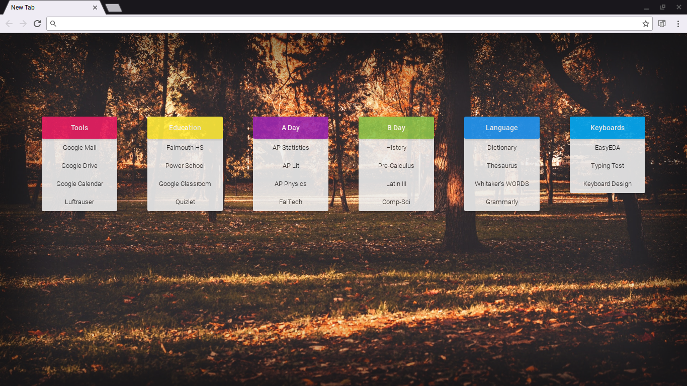
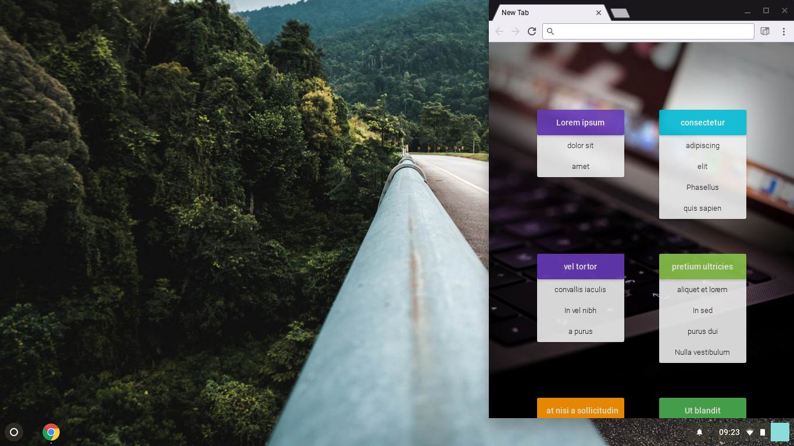
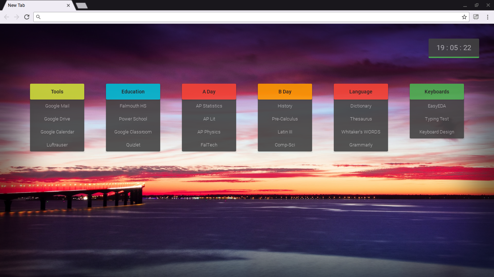

# Bookmarks Startpage  
This is a chrome extension startpage that uses chrome's bookmarks utility. It also can fetch random wallpapers from https://unsplash.com/ for the background, has a simple clock, and can get quotes from https://talaikis.com/random_quotes_api/.
## Installation
1. Download the extension [here](https://raw.github.com/rpbritton/bookmarks-startpage/master/bookmarks-startpage.crx).
2. Or load the `src` directory of this repository as an unpacked extension in `chrome://extensions`.
3. You may need to install the [Chrome Apps & Extensions Developer Tool](https://chrome.google.com/webstore/detail/chrome-apps-extensions-de/ohmmkhmmmpcnpikjeljgnaoabkaalbgc) if chrome blocks it.
## Setup
1. Create a bookmarks folder anywhere in chrome called `bookmarks-startpage`.
2. Add sub folders for your categories, and bookmarks within those for your links.
3. Click the icon in the extension toolbar to configure the extension.
___

